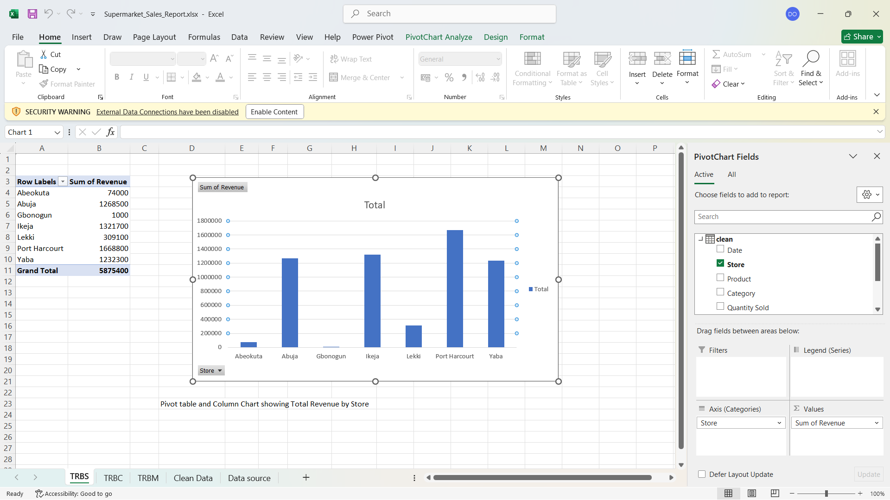

Supermarket Sales Performance Report – Excel Project

Project Overview
This Excel-based project simulates a Supermarket Sales Report for a retail business with multiple branches. The objective was to clean raw sales data and analyze performance using Pivot Tables and Pivot Charts. Although these visuals are not yet combined into a single dashboard view, they are fully dynamic and refreshable.

Data Cleaning & Transformation
Used Power Query to import and clean the raw dataset
Removed blank rows and ensured correct data types (Date, Text, Numbers)

Computed a new column:
Revenue = Quantity Sold × Unit Price

Data Analysis Performed
Built multiple Pivot Tables to summarize:
~ Total revenue by Store
~ Total revenue by Product Category
~ Monthly revenue trend by Date

Used Pivot Charts to visualize:
~ Revenue distribution across categories (Bar chart)
~ Monthly sales trend (Line chart)
~ Store comparison (Column chart)

Refresh & Automation
Added new sales entries to the raw data
Refreshed Power Query and Pivot Tables to ensure dynamic updates
Verified that all visuals and summaries were updated correctly

Key Insights
Identified top-performing stores and categories
Visualized revenue patterns over time
Demonstrated how data cleaning and modeling improve reporting

Tools Used
Microsoft Excel
Power Query
Pivot Tables
Pivot Charts

Conclusion
This project demonstrates a real-world workflow for an entry-level data analyst using Excel. It covers end-to-end analysis from raw data to automated insights, laying a strong foundation for future reporting and dashboarding using tools like Power BI.

